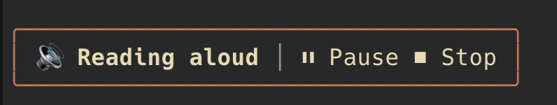

# claude-read — hear Claude Code's answers aloud

`/read` reads Claude's previous response aloud while an animated speaker shows above the prompt.



**Built on Claude Code mods.** This plugin exists thanks to [mods](https://code.claude.com/docs/en/plugins/mods/overview), Anthropic's technology for changing how Claude Code looks and behaves from inside it. Without mods, a plugin can't draw controls in Claude Code's own interface. The whole plugin is one mod, `hooks/register.tsx`, and it uses mods to:

- draw the framed band above the prompt, with the animated speaker and the buttons (`ui.render` on `AbovePrompt`)
- register `/read` as a command that runs plugin code, and the `speak` tool Claude calls (`$.command.register`, `$.tool.register`)
- run the synthesis and the player itself when Claude calls the tool (`tool.call`, `$.process`)

- **Natural voices, free.** It uses [edge-tts](https://github.com/rany2/edge-tts), the free Microsoft Edge read-aloud service: no API key, no account, no cost. Every locale works, including `es-CO`, `es-VE`, `es-US`, `es-MX`, `es-ES` and `en-US`.
- **Offline fallback.** If edge-tts is missing or there is no internet connection, it uses your OS's own voice: `say` on macOS, SAPI on Windows, `espeak-ng` on Linux.
- **One-click controls.** A framed band above the prompt has buttons to pause, resume and stop the reading. `/read stop`, `/read pause` and `/read resume` do the same.
- **Speed.** Say the speed in words: `/read faster`, `/read más lento`, `/read 30% faster`.
- **Partial reading.** Name the part you want to hear: `/read only the conclusion`.

> Speech is generated on your machine (system voices) or by the free Edge read-aloud service (edge-tts). The plugin never calls a paid API.

## Requirements

| | macOS | Windows | Linux |
| --- | --- | --- | --- |
| Claude Code | terminal, v2.1.287 or later (mods) | same | same |
| Natural voices (recommended) | `pipx install edge-tts` | `pip install edge-tts` | `pipx install edge-tts` |
| Player | `afplay` (built in) | PowerShell (built in) | `paplay` or `aplay`; `ffplay` (ffmpeg) for edge-tts audio |
| Offline voice | `say` (built in) | SAPI (built in) | `espeak-ng` |

Check edge-tts with: `edge-tts --text "hola" --write-media test.mp3`.

## Install

Type this at the Claude Code prompt:

```
/plugin install read --marketplace paulpwo/claude-read
```

Answer `y` to add the marketplace, then choose the scope (User is recommended). The plugin works right away.

## Use

Type the instructions in any language: Claude interprets them by meaning.

```
/read                        read the whole last response
/read faster                 +25%   (más rápido, mais rápido…)
/read much faster            +50%
/read slower                 -20%   (más lento…)
/read 30% faster             exact percentage, from -50% to +100%
/read only the summary       read only that part
/read solo la conclusión     the same, in Spanish
```

While it reads:

```
╭──────────────────────────────────────╮
│ 🔊 Reading aloud │ ⏸ Pause  ⏹ Stop   │
╰──────────────────────────────────────╯
```

| Control | Action |
| --- | --- |
| 🔊 | stop |
| ⏸ Pause / ▶ Resume | pause / resume |
| ⏹ Stop | stop |
| `/read stop` (`parar`, `detener`) | stop |
| `/read pause` (`pausa`) | pause |
| `/read resume` (`continue`, `reanudar`, `seguir`) | resume |

The `/read stop`, `/read pause` and `/read resume` commands act at once, without a turn, even while Claude is working. Use them when the band is hidden: a Claude Code survey takes the band's place while it shows, and `ctrl+x ctrl+a` collapses it. Claude Code does not let plugins take over keys such as Esc, so the controls are buttons and commands.

## Configure

Run `/config` and find **read**, or edit `pluginConfigs` in `~/.claude/settings.json`:

```json
{
  "pluginConfigs": {
    "read": {
      "options": {
        "engine": "auto",
        "voice": "es-CO-GonzaloNeural",
        "systemVoice": "",
        "edgeTts": "edge-tts"
      }
    }
  }
}
```

| Option | Values | Default |
| --- | --- | --- |
| `engine` | `auto` (edge-tts, then the system voice), `edge-tts`, `system` | `auto` |
| `voice` | any name from `edge-tts --list-voices` | `es-CO-GonzaloNeural` |
| `systemVoice` | macOS `say -v '?'`, Windows SAPI voice name, Linux `espeak-ng --voices`; empty = default | empty |
| `edgeTts` | command name or full path of edge-tts | `edge-tts` |

Some voices to start with:

| Locale | Voices |
| --- | --- |
| Spanish (Colombia) | `es-CO-GonzaloNeural`, `es-CO-SalomeNeural` |
| Spanish (Venezuela) | `es-VE-SebastianNeural`, `es-VE-PaolaNeural` |
| Spanish (United States) | `es-US-AlonsoNeural`, `es-US-PalomaNeural` |
| Spanish (Mexico) | `es-MX-JorgeNeural`, `es-MX-DaliaNeural` |
| English (United States) | `en-US-AndrewNeural`, `en-US-AvaNeural` |

List all of them with `edge-tts --list-voices`.

## Adapt it

The code is short and commented:

- `hooks/register.tsx` registers `/read` and the `speak` tool. The tool's description holds the rules Claude follows (speed words, which part to read, cleaning for speech): edit it to change them.
- It also runs the synthesis, controls the player and draws the speaker band.
- `scripts/*.ps1` are the Windows synthesis and playback helpers.

Run the tests with `claude plugin test .` and validate with `claude plugin validate .`.

## How it works

1. `/read` sends Claude a short request. Claude cleans its last answer for speech and calls the plugin's `speak` tool with the text and the speed.
2. The plugin runs edge-tts (or the system voice) directly, without a shell, and writes the audio to your temp folder.
3. It plays the audio in the background and shows the band. The buttons act on that player. macOS and Linux pause with signals, and Windows uses a control file.

## Troubleshooting

- **`/read` says synthesis failed.** Run `edge-tts --list-voices` to check the install and the network, or set `engine` to `system`.
- **Audio plays but the band is missing.** A Claude Code survey holds the band while it shows, or the band was collapsed with `ctrl+x ctrl+a`. Use `/read pause` or `/read stop`.
- **No sound on Linux.** Install `pulseaudio-utils` (paplay) or `alsa-utils` (aplay), plus `ffmpeg` for edge-tts audio.

## Platform status

- **macOS**: tested.
- **Linux**: implemented, not tested yet.
- **Windows**: implemented with PowerShell helpers, not tested yet. Reports and pull requests are welcome.

## License

MIT
